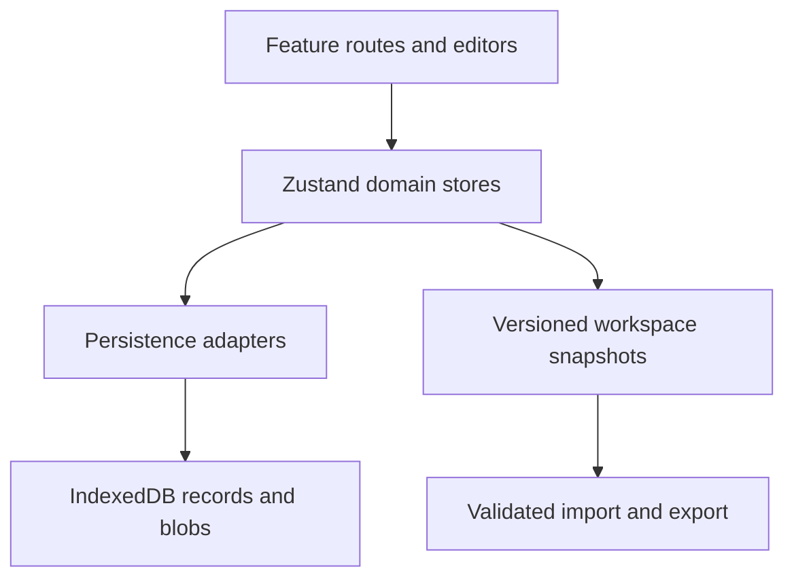

# World Studio

[](https://github.com/Quyen090hk/worldStudio/actions/workflows/quality.yml)

A local-first React workspace for creating fictional worlds. World Studio keeps
lore entries, relationships, maps, chronology, visual references, and planning
cards connected without requiring an account or server.

## Why this project exists

Worldbuilding tools often split writing, reference images, timelines, and
relationships across unrelated applications. World Studio treats an entry as a
shared domain object: the same character or location can appear in the editor,
graph, map, timeline, canvas, search, and asset library without duplicating its
source data.

## Product highlights

- Resilient Tiptap rich-text editor with local drafts, revisions, outline
  navigation, entry references, asset images, and a compatibility fallback
- Interactive Cytoscape relationship graph with filtering, focus views, and
  configurable layout behavior
- Image-based maps with layers, markers, routes, and linked entries
- Timeline records and eras with uncertainty and relationship-derived ranges
- Spatial canvas with draggable entry cards, notes, labeled connections, and
  live connector geometry
- Search across entries, page destinations, tags, summaries, and document text
- Multi-world isolation, portable JSON backups, validation, and data migration
- Responsive English/Chinese interface with keyboard navigation, focus
  management, reduced-motion support, light theme, and dark theme

## Architecture at a glance



Routes and the editor are lazy-loaded. Cytoscape and graph layout libraries are
kept in separate chunks so users do not download specialist tools before
opening the corresponding feature. See [Architecture](docs/ARCHITECTURE.md) for data
boundaries, reliability decisions, and trade-offs.

## Technology

| Area | Choice |
| --- | --- |
| UI | React 19, TypeScript, Tailwind CSS, Motion |
| Routing | React Router with lazy route modules and recovery boundaries |
| State | Feature-scoped Zustand stores |
| Persistence | IndexedDB with queued writes and normalized entry records |
| Editing | Tiptap / ProseMirror with a plain-content recovery editor |
| Graph | Cytoscape and fCoSE |
| Testing | Vitest and Playwright |
| Delivery | Vite, bundle budgets, GitHub Actions |

## Run locally

Node.js 22 and npm are recommended.

```bash
npm ci
npm run dev
```

The application is local-first. Structured world data, drafts, map images, and
asset files live in IndexedDB. Small interface preferences use `localStorage`
or `sessionStorage`. Use **Settings → Workspace backup** before clearing browser
site data.

## Quality checks

```bash
npm run lint
npm test
npm run build
npm run check:bundle
```

Install Chromium once before running browser workflows:

```bash
npx playwright install chromium
npm run test:e2e
```

The suite currently covers 65 unit tests plus browser flows for entry creation,
rich-text persistence after reload, world creation, backup export, mobile
navigation, theme switching, and unknown routes. GitHub Actions runs lint,
tests, production build, bundle budgets, and Playwright on pushes and pull
requests.

## Reliability model

- Editor input is mirrored to a recoverable draft before the user leaves the
  page; explicit revisions provide a second recovery layer.
- Writes to shared IndexedDB records are serialized to avoid stale writes
  overtaking newer state.
- Entry deletion cleans dependent graph, map, timeline, canvas, asset, and
  document references as one domain operation.
- Backups carry a format version and are validated before replacing the active
  workspace.
- Route and editor error boundaries isolate failures instead of poisoning later
  navigation in the same browser session.

## Scope and trade-offs

This is intentionally a browser-only, single-user workspace. It does not claim
real-time collaboration, cloud synchronization, authentication, or server-side
conflict resolution. Those capabilities would require a different persistence
and authorization architecture rather than another client-side store.

For a concise project walkthrough and interview discussion points, see
[面试讲解提纲](docs/INTERVIEW_NOTES.zh-CN.md).
