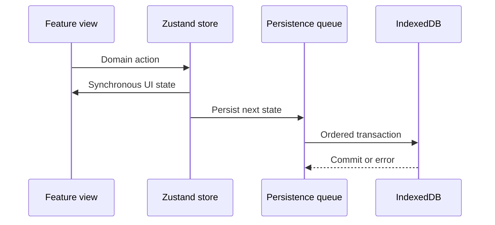

# Architecture

## Boundaries

World Studio is organized by product capability rather than by generic file
type. Each directory under `src/features` owns its page, domain types, store,
model helpers, persistence adapter, and tests. Shared infrastructure lives in
`src/shared`; application composition stays in `src/app`.

| Boundary | Responsibility |
| --- | --- |
| `app` | Route composition, lazy loading, and route-level recovery |
| `features/entries` | Lore records, rich text, drafts, revisions, media, and properties |
| `features/world` | World registry, isolation, switching, and stored snapshots |
| `features/settings` | Backup schema, validation, import, export, and migration |
| `features/assets` | Asset metadata, binary files, thumbnails, and usage references |
| `features/graph`, `map`, `timeline`, `canvas` | Specialized projections linked by entry IDs |
| `shared/storage` | IndexedDB schema, transactions, queued state writes, and test fallback |

## Data flow

The UI updates synchronously, while the persistence layer serializes writes for
each shared record. This prevents a slower earlier write from overwriting a
newer state. Entry and revision collections use normalized object stores and
fingerprints so unchanged records are not rewritten.

## World isolation

The world registry contains lightweight metadata and one active world ID. Each
world owns a versioned workspace snapshot. Switching worlds follows four steps:

1. Hydrate pending persisted stores.
2. Save the active world snapshot.
3. Load and validate the target snapshot.
4. Restore feature stores and update the active world ID.

Large binary resources remain in dedicated IndexedDB stores. Deleting a world
removes an asset or map image only when no other stored world references it.

## Editor reliability

The editor is treated as a failure-prone subsystem because extensions,
historical HTML, and browser selection state can all throw during rendering.

- Incoming HTML is normalized before rendering.
- Drafts are saved independently from the main entry record.
- Explicit revisions preserve earlier content.
- The advanced editor has its own recovery boundary.
- A plain content editor remains available if Tiptap cannot initialize.
- Route recovery resets when navigation changes, so one bad document cannot
  leave every later entry in a permanent error state.

## Referential cleanup

Entries are primary domain objects; other modules store references by ID.
Deletion is routed through one cascade action which removes or repairs dependent
relationships, map markers, timeline records, canvas cards, media references,
and rich-text entry links. Lightweight destructive actions expose an undo
window in the UI.

## Performance strategy

- Route modules are loaded with `React.lazy`.
- The Tiptap editor is dynamically imported only when an entry enters editing
  mode; Cytoscape and graph layout algorithms have dedicated vendor chunks.
- Object URLs are created only while binary previews are mounted and are then
  revoked.
- Derived map and graph collections are memoized instead of recalculated by
  unrelated renders.
- CI checks gzip budgets for the initial route, largest JavaScript chunk, and
  global stylesheet.

Bundle budgets are guardrails rather than performance claims. Real-user Core
Web Vitals would require a deployed environment and telemetry.

## Testing layers

| Layer | Purpose |
| --- | --- |
| Model tests | Validation, normalization, reference repair, and migrations |
| Store tests | Persistence, revisions, world isolation, and cascades |
| Route tests | Loading, not-found behavior, and recovery composition |
| Playwright | Critical workflows in desktop and mobile Chromium |

## Known scope limits

- Browser-local storage is tied to one origin and browser profile.
- There is no account, cloud sync, collaboration, or merge protocol.
- Very large workspaces still require pagination or virtualization work based
  on measured production data.
- Accessibility has keyboard and semantic coverage, but a formal audit with
  multiple screen readers remains a release task.
